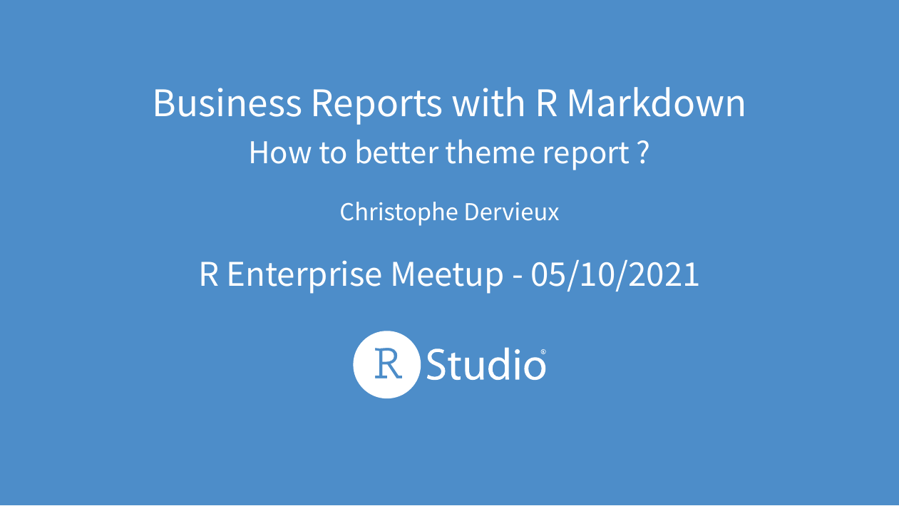

# Business Reports with R Markdown

<!-- badges: start -->
<!-- badges: end -->

## About this repo

It contains the source code for the presentation and for examples.

Slides are made using Xaringan, and published to Netlify. _Makefile_ is used to organize the build pipeline.

Some of the output can only be found in the website where the presentation is hosted through the link. Not everything is on pushed to Git. If you are looking for examples output, please look at the slides.

## Where to found the resulting presentation ?

Slides can be found at https://cderv.rbind.io/slides/meetup-rmd-style-business-report/

## Can I reproduce ? 

This project is not aimed at being used by other but it should work: 

* It uses **renv** so you can recreate the R environment to recreate the slides
* Makefile is used to build and it should work in your environment too. 
