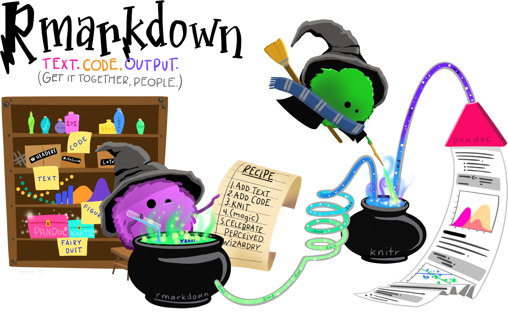

```{r xaringan-tachyons, echo=FALSE}
xaringanExtra::use_tachyons()
xaringanExtra::use_tile_view()
xaringanExtra::use_panelset()
xaringanExtra::use_logo(
  position = xaringanExtra::css_position(top = NULL, right = NULL, left = "1em", bottom = "1em"),
  width = 300/2,
  height = 105/2,
  image_url = "https://www.rstudio.com/wp-content/uploads/2018/10/RStudio-Logo-flat.svg",
  link_url = "https://www.rstudio.com"
)

# will be used several times in a cat engine
temp_file <- tempfile()
# setting option for the several cat engine
knitr::opts_template$set(cat_md = list(
  engine.opts = list(file = temp_file, lang = "markdown"),
  echo = TRUE
))
# clean tempfile after a chunk computation
knitr::knit_hooks$set(rm_temp = function(before) {
  if (!before) unlink(temp_file)
})

```

# Who am I ?

.subtitle[Short intro]

.center[

.profile[]

Christophe DERVIEUX &#8226; France

RStudio &#8226; Software Engineer &#8226; R Markdown Team

]
</br>
.pull-left[
.center[
.f2.color1[`r fontawesome::fa("github")`]</br>
[@cderv](https://github.com/cderv)
]
]

.pull-right[
.center[
.f2.color1[`r fontawesome::fa("twitter")`]</br>
[@chrisderv](https://twitter.com/chrisderv)
]
]

???

---
# What are we talking today ? 

.box[I work in an organization with some styling guidelines and I would like to use them on my R Markdown document. How does that work ?]

???

---
layout: true

# What happens when it renders ?

---

.center[]
.source-fig.center[Source: https://github.com/allisonhorst/stats-illustrations]

???

We often see these rmarkdown little wizard mixing Text & Code to produce document. Aim is to look deeper into this today. This is not so magic. It is juts perceived magic and there are tools to know about under the hood to be able to customize behavior further.

---

.center[]
.source-fig.center[
source: [R Markdown Cookbook](https://bookdown.org/yihui/rmarkdown-cookbook)
]

.box.f3[`knitr::knit()` + Pandoc (+ LaTeX) = `rmarkdown::render()`]

???

rmarkdown will run Pandoc & knitr for you.

LaTeX only needed with PDF. tinytex will run it for you.  

This is important to know all this because it helps know where to look and what could be tweak. one has to understand what to tweak to make something works as expected.

---
layout: false

# How to boost output styling ? 

.center[]

???

Let's talk about styling content now. 

---
class: inverse

# Working with HTML output

---
# What is CSS ? 

.subtitle[CSS for Cascading Stylesheets]

> While HTML is used to define the structure and semantics of your content, CSS is used to style it and lay it out. For example, you can use CSS to alter the font, color, size, and spacing of your content, split it into multiple columns, or add animations and other decorative features.

Source: https://developer.mozilla.org/en-US/docs/Learn/CSS
---

# Use CSS from inside a Rmd file

.subtitle[About the `css` engine]

````markdown
```{css, echo = FALSE}`r ''`
/* add a blue border */
div.mybox {
  border-color: blue;
  border-style: solid;
  padding: 0.5em;
}

/* Set to blue bold text inside the box */
div.mybox strong {
  color: blue;
}
```
````

Applied directly in the Rmd document without an external css file 

???

Useful for prototyping, for quick iteration, for single file example
echo = false is important if you don't want to show CSS source chunk in output

---
layout: true
# Use SASS the same way

.subtitle[About the `sass`/`scss` engine]

---

### What is SASS ?

Sass (https://sass-lang.com) is a CSS extension language that allows you to create CSS rules in much more flexible ways than you would do with plain CSS.
</br>
</br>
.center[]

It allows for variables, tweaking functions (called _mixins_), operations (like `/`), better CSS rule organisation (nesting, extensions, ...) and more.

???

External tool used by web developers. Very powerful and this is a skill to learn when doing a lot of HTML. It can do a lot ! 

But no need to use it directly. Still need to learn the feature and syntax.

---
.panelset[

.panel[.panel-name[previous css]

````markdown
```{css, echo = FALSE}`r ''`
div.mybox {
* border-color: blue;
  border-style: solid;
  padding: 0.5em;
}

div.mybox strong {
* color: blue;
}
```
````

]

.panel[.panel-name[scss]
````markdown
```{scss, echo = FALSE}`r ''`
*$color1: blue;

div {
  &.mybox {
*   border-color: $color1;
    border-style: solid;
    padding: 0.5em;

    strong {
*     color: $color1;
    }
  }
}
```
````

]
.panel[.panel-name[sass]
````markdown
```{sass, echo = FALSE}`r ''`
$color1: blue

div
  &.mybox
    border-color: $color1
    border-style: solid
    padding: 0.5em
  
    strong
      color: $color1
```
````
In both example, we are using special _SASS_ feature like [Nesting](https://sass-lang.com/documentation/style-rules/declarations#nesting) and [Parent Selector](https://sass-lang.com/documentation/style-rules/parent-selector).

]
]

???

The CSS is the one that would be render when using sass on the .scss or .sass file. 

No preference on the syntax - it is a personnal choice (and depending on environment.)

---
layout: true
# Use SASS the same way

.subtitle[Powered by the new **sass** R `r emo::ji("package")`]

---

.center[


https://rstudio.github.io/sass/

</br>
.box[Support is now built-in **rmarkdown**]

]

???

Quite new. Allow to use SASS from R. Wrapper around a C library.

Supported in rmarkdown now.

---

.panelset[

.panel[.panel-name[style.sass]

```{cat, engine.opts = list(file = "style.sass", lang = "sass")}
$color1: blue

div
  &.mybox
    border-color: $color1
    border-style: solid
    padding: 0.5em
  
    strong
      color: $color1
```


]

.panel[.panel-name[rendered CSS]

```{r, class.output='css', comment=''}
# Rendering SASS file from R
sass::sass(sass::sass_file("style.sass"))
```

```{r, include=FALSE}
unlink("style.sass")
```


]

]

???

Small intro. Best is to look at the pkgdown website.

---

External `.sass` / `.scss` file can also be passed in the `css` argument of `html_document()`

</br>

````yaml
output:
  html_document:
    css: custom-style.scss
````

The file will be processed internally by `sass::sass_file()` and produce a `.css` automatically.

???

You can do much more with SASS. It pushes the limit of customization of a document.

How to use it ? Why this CSS example ?

---
layout: true

# Use custom blocks to style

.subtitle[Powered by Pandoc's fenced divs syntax]

---

```{cat, opts.label ='cat_md'}
::: mybox
Special **important** content
:::
```

```{css, echo = FALSE}
.mybox-demo {
  border-color: blue;
  border-style: solid;
  padding: 0.5em;
}

.mybox-demo strong {
  color: blue;
}
```

With the previous style applied, it will result in this box in the document
</br></br>
.mybox-demo[
Special **important** content
]
</br></br>
```{r demo-box, echo = FALSE, results='asis', rm_temp = TRUE}
o <- tempfile()
rmarkdown::pandoc_convert(temp_file, to = "html", output = I(o))
content <- xfun::read_utf8(o)
unlink(o)
```

```{cat, engine.opts = list(lang = "html"), code = content}
```

???

Pandoc feature. R Markdown knows and extend it. 
Quite simple to write but quite powerful. 

Supported by Visual editor.

---

Attributes and id can be added too, e.g


```{cat, opts.label ='cat_md'}
::: {.mybox #box1 style="text-align: center;"}
Special **important** content
:::
```

The above add inline style to the div
</br></br>
.center.mybox-demo[
Special **important** content
]
</br></br>
```{r, include = FALSE, rm_temp = TRUE}
o <- tempfile()
rmarkdown::pandoc_convert(temp_file, to = "html", output = I(o))
content <- xfun::read_utf8(o)
unlink(o)
```

```{cat, engine.opts = list(lang = "html"), code = content}
```

???

Allow to style mainly.

---
layout: false

# What we've learn so far ? 

.subtitle[Let's sum up!]

## Customize output style

* .color2[**Customize HTML output**] using CSS and SASS code
* .color2[**Create and style custom blocks**] for HTML and office outputs

---

# How to go further ?

.subtitle[and boost even more your skills !]

.pull-left.center[

## Look at examples

Xaringan Source + Demo file in </br> .f2.color1[`r fontawesome::fa("github")`] [cderv/raukr-2021-rmd-boost](https://github.com/cderv/raukr-2021-rmd-boost)
</br></br></br>
Or quickly try with  
[`)](https://rstudio.cloud/project/2654845)

https://rstudio.cloud/project/2654845


]

.pull-right[

## More in the book

.center[


.source-fig[https://bookdown.org/yihui/rmarkdown-cookbook/]

]

]

???

Special demo file contains part of what we saw but also other recipes from the cookbook.

---
class: center middle

# Thank you !

.f2.color1[`r fontawesome::fa("github")`]</br>https://github.com/cderv/meetup-2021-rmd-business-report

```{r meta, echo=FALSE}
library(metathis)
meta() %>%
  meta_general(
    description = "A presentation at R in Enterprise meetup about styling business report with R Markdown",
    generator = "xaringan and remark.js"
  ) %>% 
  meta_social(
    title = rmarkdown::metadata$title,
    url = rmarkdown::metadata$url,
    image = "https://secure.meetupstatic.com/photos/event/9/4/d/7/clean_498998103.jpeg",
    image_alt = "Business Reports with R Markdown cover image for meetup",
    og_type = "website",
    og_author = "Christophde Dervieux",
    twitter_card_type = "summary_large_image",
    twitter_creator = "@chrisderv"
  )
```
