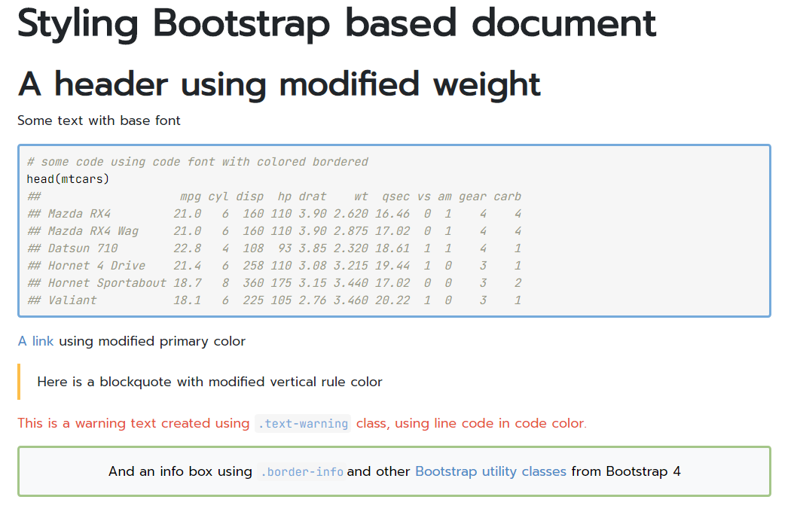

```{r xaringan-tachyons, echo=FALSE}
xaringanExtra::use_tachyons()
xaringanExtra::use_tile_view()
xaringanExtra::use_panelset()
xaringanExtra::use_logo(
  position = xaringanExtra::css_position(top = NULL, right = NULL, left = "1em", bottom = "1em"),
  width = 300/2,
  height = 105/2,
  image_url = "https://www.rstudio.com/wp-content/uploads/2018/10/RStudio-Logo-flat.svg",
  link_url = "https://www.rstudio.com"
)

# will be used several times in a cat engine
temp_file <- tempfile()
# setting option for the several cat engine
knitr::opts_template$set(cat_md = list(
  engine.opts = list(file = temp_file, lang = "markdown"),
  echo = TRUE
))
# clean tempfile after a chunk computation
knitr::knit_hooks$set(rm_temp = function(before) {
  if (!before) unlink(temp_file)
})

```

# Who am I ?

.subtitle[Short intro]

.center[

.profile[]

Christophe DERVIEUX &#8226; France

RStudio &#8226; Software Engineer &#8226; R Markdown Team

]
</br>
.pull-left[
.center[
.f2.color1[`r fontawesome::fa("github")`]</br>
[@cderv](https://github.com/cderv)
]
]

.pull-right[
.center[
.f2.color1[`r fontawesome::fa("twitter")`]</br>
[@chrisderv](https://twitter.com/chrisderv)
]
]

???

---
# What are we talking today ? 

.center-middle[

> I work in an organization with some styling guidelines and I would like to use them on my R Markdown document. 
> 
> How does that work ?

.center.pv4.big[Let's discuss about styling with R Markdown !]

]

???

Guidelines are usually colors, fonts, size but can also be document template.

We'll try cover most formats from HTML to Office Document

---
layout: true

# What happens when it renders ?

---

.center[]
.source-fig.center[Source: https://github.com/allisonhorst/stats-illustrations]

???

We often see these rmarkdown little wizard mixing Text & Code to produce document. Aim is to look deeper into this today. This is not so magic. It is juts perceived magic and there are tools to know about under the hood to be able to customize behavior further. And it is important to know about this for styling.

---

.center[]
.source-fig.center[
source: [R Markdown Cookbook](https://bookdown.org/yihui/rmarkdown-cookbook)
]

.box.f3[`knitr::knit()` + `Pandoc` (+ `LaTeX`) = `rmarkdown::render()`]

???

rmarkdown will run Pandoc & knitr for you so one input for multiple output possible. 
But stylings is specific to the output. 

This is important to know all this because it helps know where to look and what could be tweak. one has to understand what to tweak to make something works as expected.

---
layout: false
class: inverse

# Dealing with styling in output formats

.center[]

???

Let's talk about styling content now. 

---
class: inverse

# Working with HTML output

---
# What is CSS ? 

.subtitle[CSS for Cascading Stylesheets]

.center-middle[
> While **HTML** is used to define the **structure and semantics** of your content, **CSS** is used to **style it and lay it out**.  
> For example, you can use CSS to alter the font, color, size, and spacing of your content, split it into multiple columns, or add animations and other decorative features.

.source-fig.center[Source: https://developer.mozilla.org/en-US/docs/Learn/CSS]

.box[
  .ma3[
    Styling HTML output will require some CSS skills
  ]
]
]
---

# Use CSS from inside a Rmd file

.subtitle[About the `css` chunk engine]

````markdown
```{css, echo = FALSE}`r ''`
/* add a blue border */
div.mybox {
  border-color: blue;
  border-style: solid;
  padding: 0.5em;
}

/* Set to blue bold text inside the box */
div.mybox strong {
  color: blue;
}
```
````

Applied directly in the Rmd document without an external css file 

???

Useful for prototyping, for quick iteration, for single file example
echo = false is important if you don't want to show CSS source chunk in output

---
layout: true
# Use SASS the same way

.subtitle[About the `sass`/`scss` engine]

---

### What is SASS ?

Sass (https://sass-lang.com) is a CSS extension language that allows you to create CSS rules in much more flexible ways than you would do with plain CSS.
</br>
</br>
.center[]

It allows for variables, tweaking functions (called _mixins_), operations (like `/`), better CSS rule organisation (nesting, extensions, ...) and more.

???

External tool used by web developers. Very powerful and this is a skill to learn when doing a lot of HTML. It can do a lot ! 

But no need to use it directly. Still need to learn the feature and syntax.

---
.panelset[

.panel[.panel-name[previous css]

````markdown
```{css, echo = FALSE}`r ''`
div.mybox {
* border-color: blue;
  border-style: solid;
  padding: 0.5em;
}

div.mybox strong {
* color: blue;
}
```
````

]

.panel[.panel-name[scss]
````markdown
```{scss, echo = FALSE}`r ''`
*$color1: blue;

div {
  &.mybox {
*   border-color: $color1;
    border-style: solid;
    padding: 0.5em;

    strong {
*     color: $color1;
    }
  }
}
```
````
]
]

???

The CSS is the one that would be render when using sass on the .scss or .sass file. 

No preference on the syntax - it is a personnal choice (and depending on environment.)

---
layout: true
# Use SASS the same way

.subtitle[Powered by the new **sass** R `r emo::ji("package")`]

---

.center[


https://pkgs.rstudio.com/sass/

.box[Support is now built-in **rmarkdown**]

]

???

Quite new. Allow to use SASS from R. Wrapper around a C library.

Supported in rmarkdown now.

---

External `.scss` file can also be passed in the `css` argument of most output format like `html_document()`

</br>

````yaml
output:
  html_document:
    css: custom-style.scss
````

.pb3[
The file will be processed internally by `sass::sass_file()` and produce a `.css` automatically.
]

.box[Using a `.scss` file makes it easier to use variables and rules in CSS.  
Use variables to store style guide values and use theme in several places.]

???

You can do much more with SASS. It pushes the limit of customization of a document.

How to use it ? Why this CSS example ?

---
layout: true

# Use custom blocks to style

.subtitle[Powered by Pandoc's fenced divs syntax]

---

```{cat, opts.label ='cat_md'}
::: mybox
Special **important** content
:::
```

```{css, echo = FALSE}
.mybox-demo {
  border-color: blue;
  border-style: solid;
  padding: 0.5em;
}

.mybox-demo strong {
  color: blue;
}
```

.pb3[
With the previous style applied, it will result in this box in the document
]
.pb3[
.mybox-demo[
Special **important** content
]
]
```{r demo-box, echo = FALSE, results='asis', rm_temp = TRUE}
o <- tempfile()
rmarkdown::pandoc_convert(temp_file, to = "html", output = I(o))
content <- xfun::read_utf8(o)
unlink(o)
```

```{cat, engine.opts = list(lang = "html"), code = content}
```

???

Pandoc feature. R Markdown knows and extend it. 
Quite simple to write but quite powerful. 

Supported by Visual editor.

---

Attributes and id can be added too, e.g


```{cat, opts.label ='cat_md'}
::: {.mybox #box1 style="text-align: center;"}
Special **important** content
:::
```

.pb3[
The above add inline style to the div
]
.pb3[
.center.mybox-demo[
Special **important** content
]
]
```{r, include = FALSE, rm_temp = TRUE}
o <- tempfile()
rmarkdown::pandoc_convert(temp_file, to = "html", output = I(o))
content <- xfun::read_utf8(o)
unlink(o)
```

```{cat, engine.opts = list(lang = "html"), code = content}
```

???

Allow to style mainly.

---
layout: false

# Going further with Bootstrap

.subtitle[Powered by the new **bslib** R `r emo::ji("package")`]

[**bslib**](https://pkgs.rstudio.com/bslib) provides tools for customizing [Bootstrap](https://getbootstrap.com/) themes directly from R. It allows take custom theming easier and provide easy access to pre-packaged Bootswatch themes.

.pull-left[
Supported in R Markdown output format:
* `rmarkdown::html_document()` .small[(using `theme` argument)]
* `flexdashboard::flex_dashboard()` .small[(current dev version > 0.5.2)]
* `bookdown::bs4_book()` built on Bootstrap 4
]

.pull-right[
Supported in other tools:
* **DT** (since 0.18)
* **shiny** (since 1.6.0)
* **pkgdown** (current dev version > 1.6.1)
]

**rmarkdown** still don't use **bslib** by default: Simple example to activate Bootstrap 4 in `html_document()` with **bslib** and default style

```yaml
output:
  html_document:
    theme: 
      version: 4
```

???

---
layout: true

# How does that work ?

.subtitle[Showing a full example]

---

Using variables in YAML instead of a `.scss` file...

```yaml
output:
  html_document:
    theme:
      primary: "#4D8DC9"                 # Changing primary color to blue
      secondary: "#4D4D4D"               # Changing secondary to grey
      blockquote-border-color: "#FDBE4B" # Styling specific blockquote part to yellow
      lightblue: "#75AADB"               # definining another blue as variable to reuse
      code-color: "$lightblue"           # inline code color will be blue
      border-color: "$lightblue"         # as default border color
      border-width: "3px"                # increasing border width
      warning: "#E7553C"                 # warning-like text will be orange 
      info: "#A4C689"                    # info like text will be green
      headings-font-weight: 900          # increasing heading font weight
      base_font:
        google: "Prompt"                 # changing base font 
      code_font:
        google: "JetBrains Mono"         # changing code font
```
---

...to get a customized document following specific style

.fl.w-90[
.center[]
]
.fl.w-10[
.small[
Demo file: 
  * [Source Rmd](styling-bootstrap-full.Rmd)
  * [HTML output](styling-bootstrap-full.html) ]
]

---
layout: false

# Useful resources

.subtitle[Going further with HTML styling in R]

.pv5[
* Customizing **flexdashboard** (development version): https://pkgs.rstudio.com/flexdashboard/articles/theme.html

* Styling new `bookdown::bs4_book()`: https://bookdown.org/yihui/bookdown/html.html#bs4-book

* Using **bslib**: https://pkgs.rstudio.com/bslib

* Using **sass**: https://pkgs.rstudio.com/sass

* Styling  **pkgdown** (development version): https://pkgdown.r-lib.org/dev/articles/customization.html 

]

---
layout: true

# Styling Word and Powerpoint

---
.subtitle[Using template reference doc]

Using a reference document as template with R Markdown

.fl.w-50.pr4[
```yaml
output:
  word_document:
    reference_doc: template.docx
```
]

.fl.w-50.pl4[
```yaml
output:
  powerpoint_presentation:
    reference_doc: template.pptx
```
]

.underline[One way to create a template:]

1. Render once without reference doc

1. Save the resulting output as the reference doc

1. Modify the reference document to customize according to your style

1. Use the document as reference doc 

---

.subtitle[How to customize an default template ?]

.center[

]

???

Example with Word Document

---

.subtitle[How to apply custom style ?]

Using [Div & Spans](https://pandoc.org/MANUAL.html#divs-and-spans) from Pandoc Markdown syntax.

.fl.w-50.pr5[
Using fenced div attributes  
for Paragraph style
````markdown
::: {custom-style="highlight-box"}
The **`r knitr::inline_expr("heaviest_specie")`** specie is heavier than other ! 
:::
````
]

.fl.w-50.pl5[
Using Spans attributes  
for Text style:
```markdown
[One of the species lives on all islands]{custom-style="Emphatically"} and the others are specific to one island only. 
```
]

This will associate Docx Styles name to the text. Style can then be modified in template.


Documentation: [Pandoc Manual about Custom Styles](https://pandoc.org/MANUAL.html#custom-styles)

---

.subtitle[Limitations & Beyond]

.f3.color1.b[It is powered by Pandoc]

* We're limitated by their features - not everything can be customized.
* We work this summer with Pandoc team to improve Powerpoint templating mechanism.

.f3.color1.b[Unfortunatly, styling Office Document is not easy (through Pandoc or not)]

* One must know about Office Style system
* Simple customization works, more complex may not

.f3.color1.b[Other great tools for R users]

.fl.w-third.center[]
.fl.w-third.center[]
.fl.w-third.center.pt5[
Officeverse by David Gohel  
.small[https://ardata-fr.github.io/officeverse]]

---
layout: true

# What about PDF output ? 

---

.subtitle[Producing PDF]


## Creating PDF through LaTeX 

Styling needs to be done using TeX styling mechanism, with help of CTAN packages.

## Creating PDF through HTML

`r emo::ji("tada")` CSS can be used ! 

Two solutions: 

1. Printing document as-is

2. Formating and Styling HTML specically for printing (using Paged Media CSS)

---

.subtitle[About Paged Media CSS with R]

.flex.items-center[
.w-25[
.center[]
]
.w-75[
Paginate the HTML Output of R Markdown with CSS for Print
.center[https://github.com/rstudio/pagedown]
]
]

.pv5[
**pagedown** brings [Paged.js](https://www.pagedjs.org/) to R, a free and open source JavaScript library that paginates content in the browser to create PDF output from any HTML content.
]


???

**pagedown** is the tool to make paginated HTML from R but designing paged report can be tricky. 

---

.subtitle[Simplify the use of **pagedown** through templates]

.fl.w-30[

]
.fl.w-70.pa3[
Enter **pagedreport** `r emo::ji("package")`  
by Thomas Vroylandt and David Keyes 

.center.small[[Announcing pagedreport](https://rfortherestofus.com/2021/01/announcing-pagedreport/)   •   [Docs](https://pagedreport.rfortherestofus.com/)]

* Uses R Markdown to produce PDF using **pagedown**

* Offers some template than can be tweak easily
  * Colors
  * Fonts
  * Covers
  * Logo
  
]

---
layout: false

# What we've learn so far ? 

.subtitle[Let's sum up!]

.pv4[
* .color2[**Customize HTML output**] using CSS, SASS or Bootstrap variables with**bslib**

* .color2[**Create and style custom blocks**] for HTML and office outputs using Pandoc Markdown

* .color2[**Create PDF from HTML**] to benefit from CSS styling

* .color2[**Paginated HTML is a thing**], and can be done from R using **pagedown**

]

.center[]

---
class: center middle inverse

# Thank you !

.f2.white[`r fontawesome::fa("github")`]</br>https://github.com/cderv/meetup-2021-rmd-business-report

```{r meta, echo=FALSE}
library(metathis)
meta() %>%
  meta_general(
    description = "A presentation at R in Enterprise meetup about styling business report with R Markdown",
    generator = "xaringan and remark.js"
  ) %>% 
  meta_social(
    title = rmarkdown::metadata$title,
    url = rmarkdown::metadata$url,
    image = "https://secure.meetupstatic.com/photos/event/9/4/d/7/clean_498998103.jpeg",
    image_alt = "Business Reports with R Markdown cover image for meetup",
    og_type = "website",
    og_author = "Christophde Dervieux",
    twitter_card_type = "summary_large_image",
    twitter_creator = "@chrisderv"
  )
```
